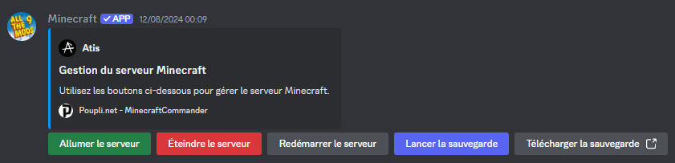

# Minecraft-ServerTools
### Ensemble de script permettant l'administration de serveur minecraft via python et shell pour une gestion du serveur via discord 

#### Le raspberry tourne 24/24 et permet via la commande !start de demarrer le serveur via le Wake On Lan

> La version avec les boutons n'est pas encore disponible 
> ( Fonctionne mais je souhaite l'ameliorer avant de push )

## Install physique et exemple

<p align="center">
  
  
  
  
  
</p>

## Methode 1 
> Prérequis curl et sudo 
#### Utilisation ( Coté serveur )
```
curl -sS https://mc-tools.poupli.net/Server | sh
```
```
curl -sS https://raw.githubusercontent.com/AtisFPS/Minecraft-ServerTools/main/ServerMC/setup.sh | sh
```

#### Utilisation ( Coté raspberry )
```
curl -sS https://mc-tools.poupli.net/Rasp | sh
```
```
curl -sS https://raw.githubusercontent.com/AtisFPS/Minecraft-ServerTools/main/Rasp/setup.sh | sh
```
## Methode 2
#### Utilisation ( Coté serveur )
```
wget -o srv-setup.sh https://mc-tools.poupli.net/Server 
```
```
wget -o srv-setup.sh https://raw.githubusercontent.com/AtisFPS/Minecraft-ServerTools/main/ServerMC/setup.sh
```

#### Utilisation ( Coté raspberry )
```
wget -o rasp-setup.sh https://mc-tools.poupli.net/Rasp
```
```
wget -o rasp-setup.sh https://raw.githubusercontent.com/AtisFPS/Minecraft-ServerTools/main/Rasp/setup.sh
```


>### Contributeur 
<a href="https://github.com/AtisFPS/ToolsBox/graphs/contributors">
  
</a>

## Support // Contact

- atis@poupli.net // atisfps@gmail.com
- https://discord.com/invite/sSYEQUcwtf
